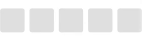
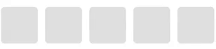
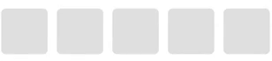
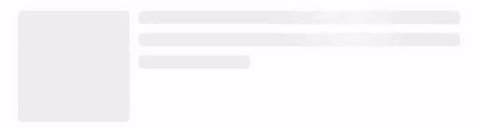
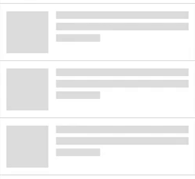

#  ShimmerView  [](https://opensource.org/licenses/MIT)

ShimmerView is a collection of APIs to construct Skelton View + Shimmering Effect type loading indicator on UIKit and SwiftUI. This framework is inspired by Facebook's [Shimmer](https://github.com/facebook/Shimmer).



## Installation

### Carthage
```
github "mercari/ShimmerView"
```

### Cocoapods
```
pod 'ShimmerView'
```

## Feature
### Synchronized Effect
The shimmering effect would be effectively displayed when all the subviews’s effect in the screen is synced and animated together.

| Not Synced | Synced |
|---|---|
|||

ShimmerView calculates its relative coordinate against the sync target and synchronize the shimmering effect with other ShimmerViews.

### Customizable
You can customize the appearance of the shimmer effect by using `ShimmerViewStyle`.
```swift
let style = ShimmerViewStyle(
    baseColor: UIColor(red: 239/255, green: 239/255, blue: 239/255, alpha: 1.0),
    highlightColor: UIColor(red: 247/255, green: 247/255, blue: 247/255, alpha: 1.0),
    duration: 1.2,
    interval: 0.4,
    effectSpan: .points(120),
    effectAngle: 0 * CGFloat.pi)
```

## Usage on SwiftUI (iOS 14.0+)
`ShimmerView` has two related APIs on SwiftUI as below:
- `ShimmerScope`
- `ShimmerElement`

You can create a custome loading indicator by combining these APIs and other `SwiftUI` APIs.
```swift
struct Placeholder: View {

    @State
    private var isAnimating: Bool = true

    var body: some View {
        ShimmerScope(isAnimating: $isAnimating) {
            HStack(alignment: .top) {
                ShimmerElement(width: 100, height: 100)
                    .cornerRadius(4)
                VStack(alignment: .leading, spacing: 8) {
                    ShimmerElement(height: 12)
                        .cornerRadius(4)
                    ShimmerElement(height: 12)
                        .cornerRadius(4)
                    ShimmerElement(width: 100, height: 12)
                        .cornerRadius(4)
                }
            }
            .padding(.horizontal, 16)
        }
    }
}
```



### ShimmerScope
`ShimmerScope` is a container view to sync the animation timing and style of all the `ShimmerElement`s in its content.

Please note that `ShimmerScope` uses `GeometryReader` in its body function and it doesn't fit to the content but expands to the parent view bounds.

### ShimmerElement
`ShimmerElement` is a view to show the shimmering effect animation.

`ShimmerElement` looks for `EnvironmentObject` injected by `ShimmerScope` so please make sure to use it as a sub view of `ShimmerScope`'s `content` function.

## Usage on UIKit
`ShimmerView` has four related APIs on UIKit as blow:
- `ShimmerView`
- `ShimmerSyncTarget`
- `ShimmerReplicatorView`
- `ShimmerReplicatorViewCell`

### ShimmerView
`ShimmerView` is a subclass of `UIView` that has `CAGradientLayer` as a sublayer and encapsulates the logic for the shimmering effect animation.
```swift
let shimmerView = ShimmerView()
view.addSubview(shimmerView)
shimmerView.startAnimating()
```

The style of `ShimmerView` can be customized with `ShimmerViewStyle`.
```swift
let style = ShimmerViewStyle.default
shimmerView.apply(style: style)
```

### ShimmerSyncTarget
`ShimmerView` can be used as it is, but to make the best effect, create a view or view controller that contains multiple ShimmerViews and specify the container as `ShimmerSyncTarget`. ShimmerView will calculate its relative origin against the target and adjust the effect automatically.

### ShimmerReplicatorView & ShimmerReplicatorViewCell
`ShimmerReplicatorView` will let you create a list type loading screen with a few lines of code. It replicates the `ShimmerReplicatorViewCell` provided by the `cellProvider` closure to fill the bounds of the view.



```swift
let replicatorView = ShimmerReplicatorView(
    itemSize: .fixedSize(CGSize(width: 80, height: 80)),
    interitemSpacing: 16,
    lineSpacing: 0,
    horizontalEdgeMode: .within,
    cellProvider: { () -> ShimmerReplicatorViewCell in
        let cell = ShimmerView()
        cell.layer.cornerRadius = 8.0
        cell.layer.masksToBounds = true
        return cell
})
replicatorView.startAnimating()
```

## Contribution

Please read the CLA carefully before submitting your contribution to Mercari.
Under any circumstances, by submitting your contribution, you are deemed to accept and agree to be bound by the terms and conditions of the CLA.

[https://www.mercari.com/cla/](https://www.mercari.com/cla/)


## License

Copyright 2020 Mercari, Inc.

Licensed under the MIT License.
